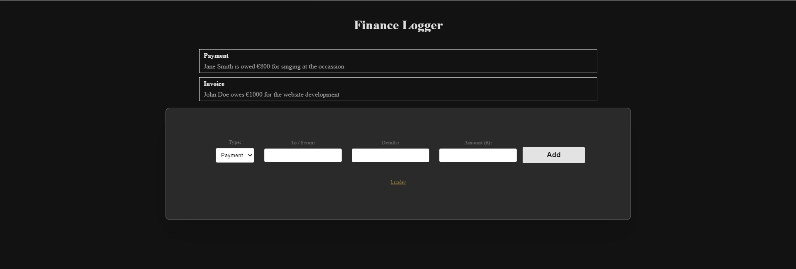

# Typescript Finance Logger

## Introduction
This is a simple logging application written in TypeScript. The application allows the user to enter details about a payment or invoice and then adds that information to a list of transactions. It is a simple TypeScript project that demonstrates how to use classes and interfaces to create invoices and payments.

## Preview



## Installation
To install and run this TypeScript project, you will need to have the following tools installed:

- Node.js
- npm (the Node.js package manager)
- TypeScript

Once you have the required software installed, follow these steps to get started:

1. Clone the repository on your local machine using the following command:

```
git clone https://github.com/Omolara5861/finance-logger.git
```

2. Navigate to the project directory:

```
cd finance-logger
```
3. To start the TypeScript compiler and run the project run:

```
npm start
```

## Usage
The project consists of several TypeScript files that are used to create invoices and payments. Here's an overview of the most important files:

- interface.ts - Defines the HasFormatter interface that is implemented by the Invoice and Payment classes.
- invoice.ts - Defines the Invoice class that represents an invoice.
- payment.ts - Defines the Payment class that represents a payment.
- list-template.ts - Defines the ListTemplate class that is used to render a - list of invoices or payments.

**The main entry point of the project is app.ts. This file creates an instance of the ListTemplate class and listens for the form submit event. When the form is submitted, it creates either an Invoice or Payment instance based on the selected type and renders it using the ListTemplate class.**

## Technologies
This project was built with VS Code using:

+ HTML
+ CSS
+ TypeScript
